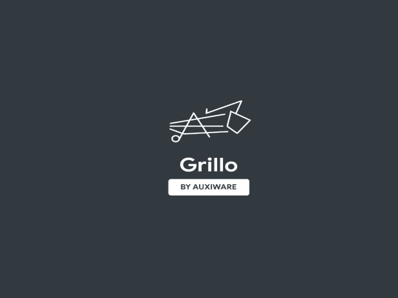

# Grillo Api

[![NPM Version][npm-image]][npm-url]
[![Downloads Stats][npm-downloads]][npm-url]

> The official Restful api of the React/React-Native front-end project.

The grillo api provides a modern and faster web services architecture.
This api is currently in development stage, the deadline of the beta version is expected to December/2019.



## Installation

Debian based Linux distributions:

```sh
sudo yarn install
```

Windows:

```sh
yarn install
```

After, run the following command in the api root directory:

```sh
npm start
```
The server will run on the port ```3000```;

## Usage example

The grillo api use http protocol to work with uri routing, however you need to know how are the routes.
below contains all access routes and their operation:

| Method | Uri                       | Functionality                                         | Content-Type                                |
|--------|---------------------------|-------------------------------------------------------|---------------------------------------------|
| POST   | /cadastro                 | used to create a new user collection in the database. | json                                        |
| POST   | /usuario/imagens/:user_id | add a profile picture to an existing user.            | image/jpeg,  image/pjpeg, image/png, image/gif |
| GET    | /usuarios                 | get all registered users.                             | json                                        |
| GET    | /usuario/:id              | get a single user data through id passed by url.      | json                                        |
| GET    | /usuario/imagem/:id       | get profile image of a user.                          | file/image                                  |
| PUT    | /usuario/:id              | update a user data.                                   | json                                        |
| DELETE | /usuario/:id              | delete an user from database.                         | json                                        |


## Development setup

To run this project in the development mode, you will use nodemon dev tool, located in the "dev" package.json script setup:

```sh
npm run dev
```

## Meta

Messias Geovani – [Linkedin/MessiasGeovani](https://www.linkedin.com/in/messias-geovani-00125416a?lipi=urn%3Ali%3Apage%3Ad_flagship3_profile_view_base_contact_details%3BGnSoFwiETD%2BtGrv4dF9mSw%3D%3D) – messias.geovani.lima@gmail.com

Distributed under the Auxiware open source license. See ``LICENSE`` for more information.

[https://github.com/messiasGeovani](https://github.com/messiasGeovani)

## Contributing

1. Fork it (<https://github.com/messiasGeovani/grillo-api/fork>)
2. Create your feature branch (`git checkout -b feature/fooBar`)
3. Commit your changes (`git commit -am 'Add some fooBar'`)
4. Push to the branch (`git push origin feature/fooBar`)
5. Create a new Pull Request

<!-- Markdown link & img dfn's -->
[npm-image]: https://img.shields.io/npm/v/datadog-metrics.svg?style=flat-square
[npm-url]: https://npmjs.org/package/datadog-metrics
[npm-downloads]: https://img.shields.io/npm/dm/datadog-metrics.svg?style=flat-square
