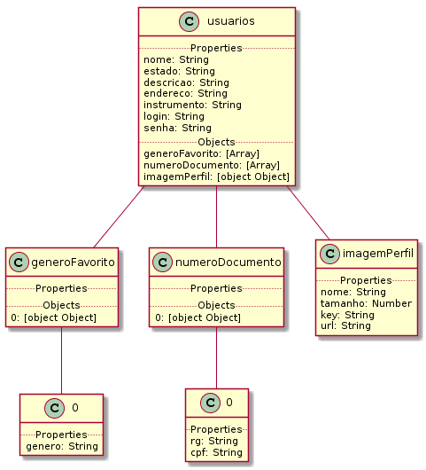
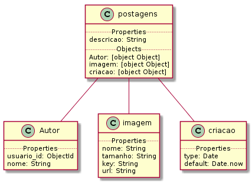
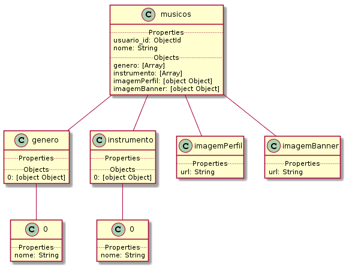
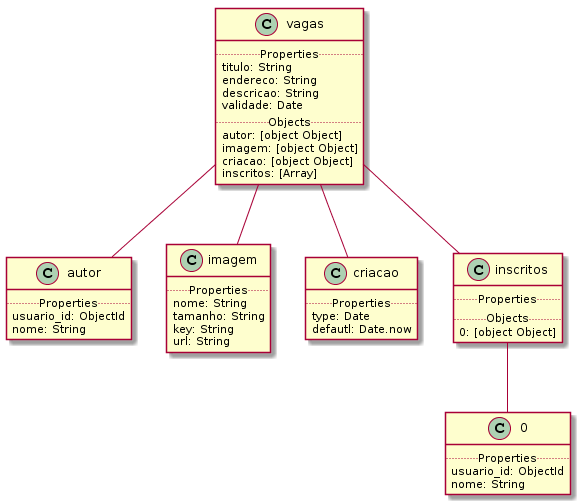

# Grillo Api

> Database Structure

## Index:
  - [Home](https://github.com/messiasGeovani/grillo-api)
  - [Routes](https://github.com/messiasGeovani/grillo-api/blob/master/wiki/ROUTES.md)

### Database structure:

The grillo project was maked using the noSQL database query language, and the database managment system used to create the structure is MongoDB.
The files of the database collection models was located in the [```routes```](https://github.com/messiasGeovani/grillo-api/tree/master/src/routes) directory.
Below contains the application database collections structure:

## ```User``` collection model:

<p align="center">
  
</p>


## ```Post``` collection model:

<p align="center">
  
</p>


## ```Musicians``` collection model:

<p align="center">
  
</p>


## ```Vacancy``` collection model:

<p align="center">
  
</p>
